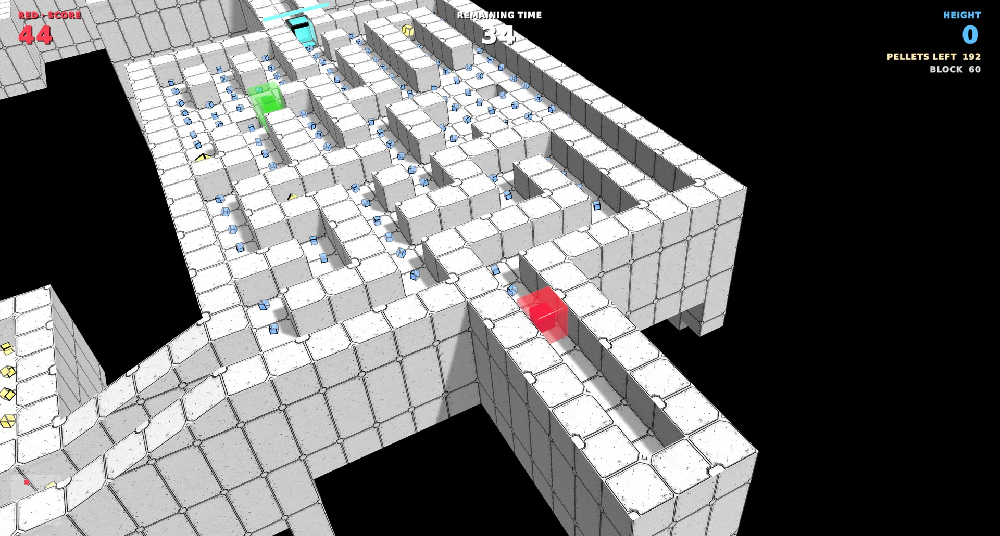
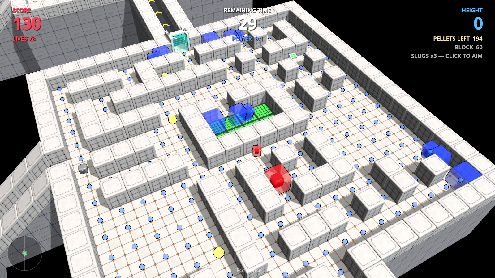
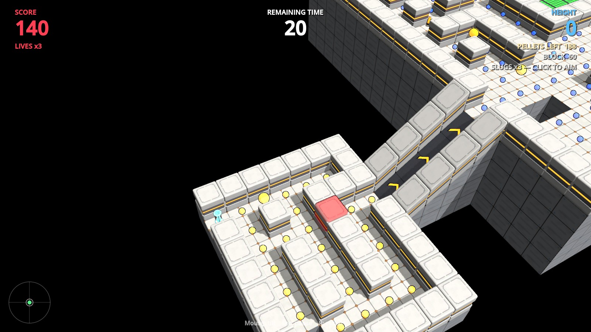
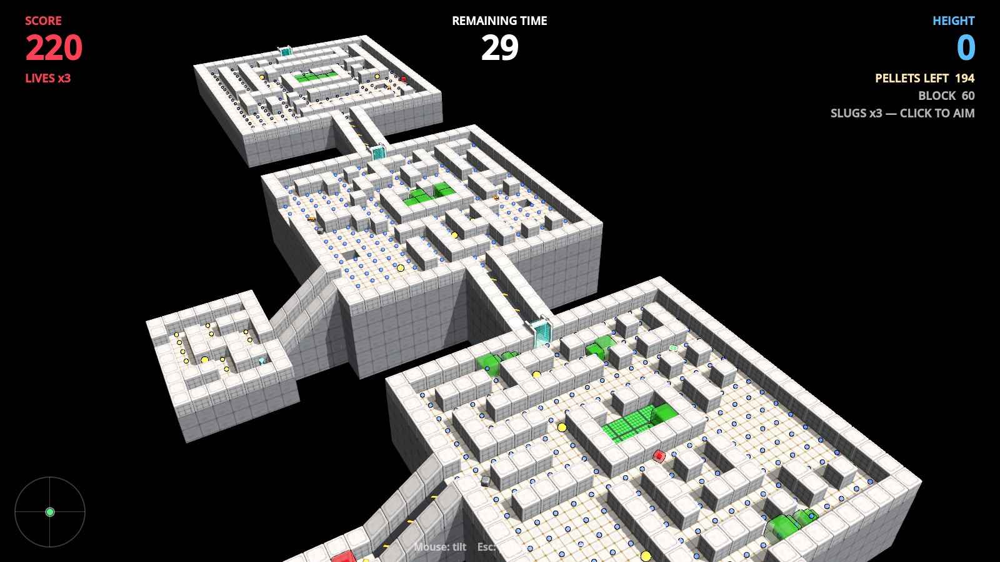
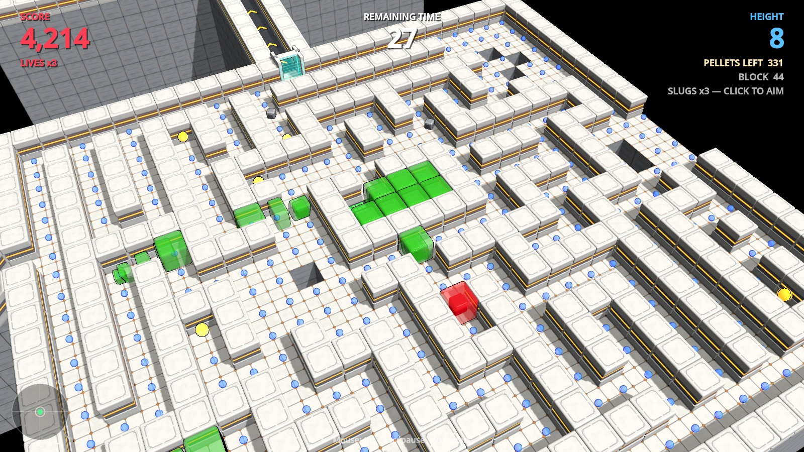

# Slock

**A Pixelhack Studios Production, in association with Scott O'Nanski.**

Tilt the world to slide a jelly block through an endless, procedurally generated maze.

**[Visit the Slock website](https://pixelhackstudios.github.io/slock/)** to watch the teaser and try tilting a corridor.

## ▶ Download & play

**[Get the latest build from the Releases page](https://github.com/pixelhackstudios/slock/releases)**. It's free, and there's nothing to install.

| | |
|---|---|
| **Windows** | Download `Slock-Windows.zip`, extract it, run `Slock.exe` |
| **Mac** | Download `Slock-Mac.zip`, extract it, then **right-click `Slock.app` → Open** (it isn't signed by Apple yet, so a normal double-click is blocked the first time) |
| **Linux** | Download `Slock-Linux.tar.gz`, extract it, run `Slock/Slock.x86_64` |

Slock is in early development. If it doesn't start or something breaks, please [open an issue](https://github.com/pixelhackstudios/slock/issues).

| | |
|---|---|
|  |  |
|  |  |

## How to play

You are **Slock**, a red jelly block. You don't move Slock — you **tilt the world** and Slock slides downhill.
Eat every pellet in a section to open its gate, go through, and keep climbing before the clock runs out.

### Controls

| | |
|---|---|
| **Mouse** (or gamepad left stick) | Tilt the world |
| **Left click** | Aim a slug — click again to fire |
| **Esc** | Pause (and change control settings) |
| **R** | Restart |

### Moving

- Tilt gently to **creep**; tilt hard to **slide**. Tilt the other way to slow down.
- Slock runs along the corridors and turns into side openings when you tilt toward them — but come in too fast and you'll slide right past.
- **Holes and open edges are deadly.** Fall off and the run is over.

### The clock

You start with **35 seconds**. Keep it topped up:

| | |
|---|---|
| Blue pellet | +1 second |
| Small yellow pellet | +2 seconds |
| Clock pickup | +20 seconds |
| Getting through a gate | Bonus time |

### Slorms

Green worms that crawl out of the pen in the middle of each section, **one at a time**. There's one more of them in every new section.

- **Touch one and it steals a third of your time**, and you bounce about 3 tiles apart.
- **Grab a power gem** and they turn **blue** for 10 seconds (+5 seconds on your clock). Blue Slorms are slow — **eat them** for **+10 seconds**, plus all the time they stole from you.

### Slugs (emergency only)

You start with **3 slugs**. Each gate gives back what you used, **plus one more**.

1. **Click** — the game freezes and you're in aim mode. **There's no backing out.**
2. **Tilt** to aim. The one thing you'll hit glows **red**: a Slorm, or an inner wall block, up to **4 tiles** away.
3. **Click** again to fire. A Slorm is destroyed (+10 seconds plus its stolen time) or a wall block is blasted open.

Outer walls can't be broken. A missed shot is still a used slug — save them.

### Powerups

Each section has three powerups scattered at random, and they work the moment you touch them. Ten seconds after you take one, a new one appears somewhere you've already cleared.

| | |
|---|---|
| Three blue dots | A quarter of the section's pellets vanish (at most one per section) |
| Steel block | **Slock of Steel** for 10 seconds: push into an inner wall to smash it, and Slorms you hit are smashed too |
| Three slugs | Slugs refilled |
| One big slug | One extra slug |
| Green patch | Every hole is filled in and every gap in the outer walls is closed off, in the section and its side room (at most one per section) |

### Gates and sections

- The gate at the far end opens when you've **eaten every pellet** in the section — or found its **key**.
- Once you're through, the way back seals behind you.
- Every section is bigger, with **smaller blocks**, more Slorms and more holes. Slock shrinks to fit.

## What you need

- **Unity 6000.6.3f1** (Unity 6.6), installed through [Unity Hub](https://unity.com/download). The free Personal licence is fine.
- The **Build Support** module for the platform you're building for (for example *Linux Build Support*), added in Unity Hub under *Installs → Add modules*.

## Build it

1. In Unity Hub, click **Add → Add project from disk** and choose this folder, then open it.
2. In the Unity menu bar, choose **Slock → Build Linux**, **Build Windows** or **Build Mac**.
   Each build is written to `Builds/<platform>/`.

To just play it in the editor, open `Assets/Scenes/SampleScene` and press **▶ Play**.

## Contributing

1. **Fork** this repo on GitHub, then clone your fork.
2. Make your changes on a new branch and push them to your fork.
3. Open a **pull request** here describing what you changed and why.

## Licence

Code: [MIT](LICENSE). Art: [CC BY 4.0](LICENSE-ART.md). Please credit Pixelhack Studios (Scott O'Nanski) — https://www.pixelhackstudios.com

## Support

Slock is free. If you enjoy it and want to help keep it going, you can [buy me a coffee on Ko-fi](https://ko-fi.com/pixelhackstudios) ☕
